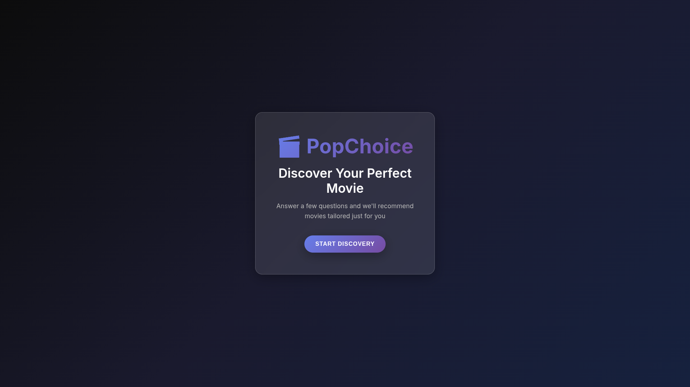
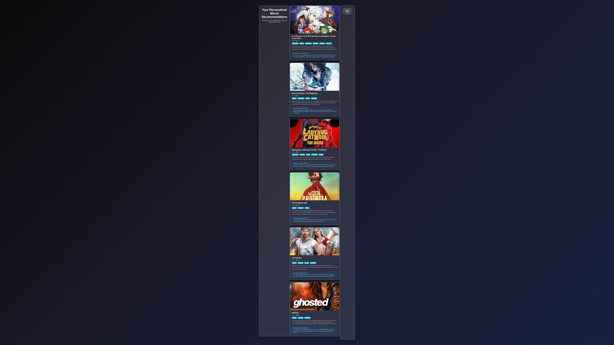

# PopChoice - AI-Powered Movie Recommendation App

PopChoice is a full-stack web application that provides personalized movie recommendations using TMDB and OpenAI APIs. Users answer a questionnaire about their preferences, and the app returns intelligently curated movie suggestions with AI-generated reasoning.

##  Features

- **Interactive Questionnaire**: 7-step questionnaire to capture user preferences
- **TMDB Integration**: Fetches real movie data from The Movie Database API
- **OpenAI Intelligence**: Uses GPT-3.5 to provide personalized recommendations with reasoning
- **Modern UI**: Beautiful, responsive design with glass-morphism effects
- **Real-time Recommendations**: Fast API-driven recommendations
- **Detailed Movie Information**: Modal dialogs with comprehensive movie details

##  Screenshots

### Welcome Screen

*Clean and inviting welcome screen with the PopChoice branding and call-to-action button*

### Recommendations View

*Personalized movie recommendations displayed in an elegant card layout with detailed information and AI-generated reasoning*

## Tech Stack

### Frontend
- **HTML5/CSS3**: Modern responsive design
- **Vanilla JavaScript**: ES6 classes and async/await
- **CSS Grid/Flexbox**: Responsive layouts
- **Custom CSS**: Glass-morphism design system

### Backend
- **Node.js**: Server runtime
- **Express.js**: Web framework
- **TMDB API**: Movie database
- **OpenAI API**: AI-powered recommendations
- **Axios**: HTTP client
- **CORS**: Cross-origin resource sharing

## Prerequisites

- Node.js (v14 or higher)
- NPM or Yarn
- TMDB API key
- OpenAI API key

## Installation

1. **Clone the repository**
   ```bash
   git clone <repository-url>
   cd PopChoice
   ```

2. **Install dependencies**
   ```bash
   npm install
   ```

3. **Set up environment variables**
   The `.env` file should already contain:
   ```env
   OPENAI_API_KEY="your_openai_key_here"
   TMDB_API_KEY="your_tmdb_key_here"
   TMDB_BEARER_TOKEN="your_tmdb_bearer_token_here"
   PORT=3000
   ```

4. **Start the server**
   ```bash
   npm start
   ```

5. **Open your browser**
   Navigate to `http://localhost:3000`

## Testing

The project includes several test scripts located in the `/tests` directory:

- **test-api.js** - Tests the API recommendations endpoint
- **test-final.js** - Tests unique reasoning improvements
- **test-map-logic.js** - Tests Map-based reasoning logic
- **test-narrative.js** - Tests narrative reasoning quality
- **test-reasoning.js** - Quick reasoning fix tests
- **test-mock-ai.js** - Simulates OpenAI responses

To run a test (ensure server is running first):
```bash
node tests/test-api.js
```

Note: The npm test script currently returns a placeholder. Individual test scripts must be run manually.

## How It Works

### 1. User Journey
1. **Welcome Screen**: Users start their movie discovery journey
2. **Questionnaire**: 7 questions about preferences:
   - Preferred genres (multi-select)
   - Era preference (classic/modern/recent)
   - Mood (emotional/thrilling/fun/uplifting)
   - Runtime preference (short/long/any)
   - Viewing context (date night/family time/solo evening/etc.)
   - Rating preference (highly-rated/good-rated/any)
   - Themes (friendship/adventure/mystery/etc.)
3. **Loading**: AI processes the preferences
4. **Results**: Personalized recommendations with reasoning

### 2. Backend Process
1. **TMDB Discovery**: Filters movies based on concrete criteria (genre, year, rating)
2. **OpenAI Intelligence**: Analyzes remaining candidates against subjective preferences
3. **Curated Results**: Returns top 5 movies with AI-generated reasoning

### 3. Frontend Architecture
- **PopChoiceApp Class**: Main application controller
- **UIManager Class**: Handles all DOM manipulation and UI updates
- **Modular Design**: Separation of concerns between logic and presentation

## Project Structure

```
PopChoice/
├── server.js              # Express server with API endpoints
├── index.html             # Main HTML file (frontend entry point)
├── package.json           # Node.js dependencies
├── .env                   # Environment variables (API keys) - not in repo
├── public/                # Static frontend assets
│   ├── css/
│   │   └── style.css      # Comprehensive styling
│   └── js/
│       └── main.js        # Frontend application logic
├── tests/                 # Test scripts for API and functionality
│   ├── test-api.js        # API endpoint tests
│   ├── test-final.js      # Final reasoning tests
│   ├── test-map-logic.js  # Map-based logic tests
│   ├── test-mock-ai.js    # Mock AI response tests
│   ├── test-narrative.js  # Narrative reasoning tests
│   └── test-reasoning.js  # Reasoning logic tests
├── docs/                  # Documentation and demo scripts
│   ├── demo-narrative.js  # Narrative demonstration
│   └── final-summary.js   # Project summary documentation
├── screenshots/           # Application screenshots
│   ├── welcome-screen.png # Welcome screen image
│   └── recommendations-view.png # Recommendations view image
├── render.yaml            # Render.com deployment configuration
├── LICENSE                # MIT License
└── README.md              # This file
```

## API Endpoints

### POST /api/recommendations
Generates movie recommendations based on user preferences.

**Request Body:**
```json
{
  "genres": ["action", "sci-fi"],
  "era": "recent",
  "mood": "thrilling",
  "runtime": "any-length",
  "context": "solo-evening",
  "rating": "highly-rated",
  "themes": ["adventure"]
}
```

**Response:**
```json
[
  {
    "id": 123456,
    "title": "Movie Title",
    "poster_path": "https://image.tmdb.org/t/p/w500/poster.jpg",
    "overview": "Movie description...",
    "release_year": 2023,
    "vote_average": 8.5,
    "reasoning": "AI-generated explanation of why this movie fits your preferences"
  }
]
```

### GET /api/health
Health check endpoint.

## Design Features

- **Glass-morphism UI**: Modern translucent design elements
- **Responsive Design**: Works on desktop, tablet, and mobile
- **Smooth Animations**: CSS transitions and keyframe animations
- **Color-coded Genres**: Visual genre tags for easy identification
- **Loading States**: User feedback during API calls
- **Error Handling**: Graceful error messages and fallbacks

## Environment Variables

| Variable | Description | Required |
|----------|-------------|----------|
| `OPENAI_API_KEY` | OpenAI API key for GPT recommendations | Yes |
| `TMDB_API_KEY` | The Movie Database API key | Yes |
| `TMDB_BEARER_TOKEN` | TMDB Bearer token for API access | Yes |
| `PORT` | Server port (default: 3000) | No |

## Deployment

### Local Development
```bash
npm start
```

### Production
```bash
npm install --production
NODE_ENV=production npm start
```

## Contributing

1. Fork the repository
2. Create a feature branch
3. Make your changes
4. Test thoroughly
5. Submit a pull request

## License

This project is licensed under the MIT License - see the LICENSE file for details.

## Acknowledgments

- **TMDB**: For providing comprehensive movie data
- **OpenAI**: For intelligent recommendation capabilities
- **Inter Font**: For beautiful typography
- **Community**: For inspiration and feedback

## Known Issues

- OpenAI may occasionally use fallback logic if API limits are reached
- Movie cast information is limited in TMDB discovery endpoint
- Some older movies may have limited poster images

## Future Enhancements

- User accounts and saved preferences
- Movie trailer integration
- Social sharing features
- Advanced filtering options
- Recommendation history
- Mobile app version

---

**Made with ❤️ for movie lovers everywhere**
